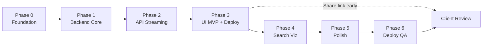
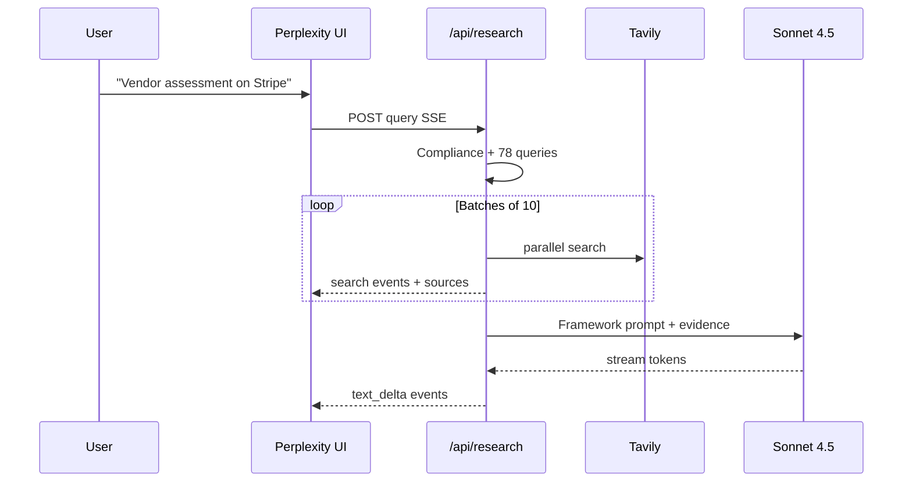

# Kriyagni — Perplexity for Finance (Phased Plan)

## Assignment Context

| Requirement | Detail |
|-------------|--------|
| Product | **"Perplexity for finance"** |
| Backend | [BI Framework repo](https://github.com/maheshlahotiih/Kriyagni-AI-Business-Research-Framework) |
| LLM | Sonnet 4.5 via Anthropic API |
| Search | **70-80 parallel web searches** per request |
| UI | Perplexity-clone — live search visualization is the wow factor |
| Deliverable | Deployed Vercel preview link |
| Timeline | ~3 days total (Day 1 shippable MVP, Days 2-3 polish) |

---

## Phase Overview

```mermaid
gantt
    title Kriyagni Delivery Phases
    dateFormat X
    axisFormat %s

    section Foundation
    Phase0_Scaffold           :p0, 0, 3
    section Backend
    Phase1_SearchEngine         :p1, after p0, 6
    Phase2_APIStreaming         :p2, after p1, 4
    section Frontend
    Phase3_UIMVP                :p3, after p2, 5
    Phase4_SearchViz            :p4, after p3, 6
    Phase5_Polish               :p5, after p4, 6
    section Ship
    Phase6_DeployQA             :p6, after p5, 3
```



| Phase | Name | Est. time | Outcome |
|-------|------|-----------|---------|
| **0** | Foundation | 2-3 hrs | Runnable Next.js app with design tokens |
| **1** | Backend Core | 4-6 hrs | 70-80 search pipeline + BI prompts |
| **2** | API & Streaming | 3-4 hrs | Working SSE endpoint, Sonnet synthesis |
| **3** | UI MVP | 4-5 hrs | **First deploy** — end-to-end functional |
| **4** | Search Visualization | 4-6 hrs | Perplexity wow factor — live 70+ search UI |
| **5** | Polish | 4-6 hrs | Citations, animations, mobile, history |
| **6** | Deploy & QA | 2-3 hrs | Production-ready demo for evaluators |

**Dependency chain:** 0 → 1 → 2 → 3 → 4 → 5 → 6 (Phases 1+2 can partially overlap with Phase 0 tail)

---

## Phase 0 — Foundation

**Goal:** Empty repo becomes a runnable Next.js project with Perplexity design tokens in place.

**Tasks:**
- Fork/clone `maheshlahotiih/Kriyagni-AI-Business-Research-Framework`
- `create-next-app` (App Router, TypeScript, Tailwind) in same repo — keep existing README/USAGE/CONTRIBUTING
- Install deps: `@anthropic-ai/sdk`, shadcn/ui, `react-markdown`, `remark-gfm`, `zod`, `framer-motion`
- Set up `globals.css` design tokens: cream `#fdfbfa`, teal `#016a71`, sidebar `#1a1a1a`, Inter font
- Create `.env.example` with `ANTHROPIC_API_KEY`, `ANTHROPIC_MODEL`, `TAVILY_API_KEY`
- Stub `app/page.tsx` with static Perplexity layout shell (no logic yet)

**Deliverables:**
- `npm run dev` works
- Cream canvas + dark sidebar visible
- Folder structure scaffolded per plan

**Exit criteria:**
- [ ] Dev server runs without errors
- [ ] Design tokens match Perplexity palette
- [ ] All Phase 1 directories exist (`lib/search/`, `lib/prompts/`, `lib/research/`)

---

## Phase 1 — Backend Core

**Goal:** The BI framework logic lives in code — query generation, search execution, evidence processing.

**Tasks:**

| Task | File(s) |
|------|---------|
| Research types (intake, depth, objectives) | `lib/research/types.ts` |
| Compliance gate (block prohibited requests) | `lib/research/compliance-gate.ts` |
| Port BI spec → Sonnet system prompt | `lib/prompts/system.ts`, `compliance.ts`, `templates.ts`, `focus-areas.ts` |
| Query builder — 12-14 queries × 6 focus areas = 72-84 | `lib/search/query-builder.ts` |
| Tavily search provider | `lib/search/tavily.ts` |
| Domain → Tier 1-4 classifier | `lib/search/tier-classifier.ts` |
| Dedup, rank, trim for context budget | `lib/search/aggregate.ts` |
| Batched parallel execution (10 concurrent, 200ms gap) | `lib/search/batch-runner.ts` |

**Deliverables:**
- `buildQueries("Stripe", "vendor_assessment")` returns 70+ queries
- `runSearchBatch(queries)` returns deduped, tier-ranked sources
- Compliance gate rejects surveillance/PII requests

**Exit criteria:**
- [ ] Unit-testable: query builder outputs 70+ queries for any entity
- [ ] Tavily returns results for a test query
- [ ] Tier classifier maps sec.gov → T1, reuters.com → T2, etc.
- [ ] Aggregate trims to ≤120 sources with snippets ≤300 chars
- [ ] System prompt includes all framework requirements (tiers, confidence, 4-level output, gaps)

**Can test without UI:**
```bash
# Temporary script or API route stub
node -e "require('./lib/search/query-builder').buildQueries('Stripe')"
```

---

## Phase 2 — API & Streaming

**Goal:** Single API endpoint orchestrates the full pipeline and streams progress + answer to the client.

**Tasks:**

| Task | File(s) |
|------|---------|
| SSE event helpers | `lib/research/stream.ts` |
| Pipeline orchestrator (compliance → search → dedup → Sonnet) | `lib/research/orchestrator.ts` |
| Anthropic SDK client + streaming | `lib/anthropic/client.ts` |
| API route with SSE response | `app/api/research/route.ts` |
| Entity extraction from natural language query | `lib/research/entity-parser.ts` |

**SSE event protocol:**

| Event | When |
|-------|------|
| `search_started` | Queries generated |
| `query_executing` | Each batch item starts |
| `query_complete` | Each batch item finishes |
| `source_found` | Each unique source discovered |
| `search_complete` | All searches done |
| `synthesis_started` | Sonnet call begins |
| `text_delta` | Answer token streamed |
| `followups` | Related questions generated |
| `error` / `done` | Terminal states |

**Deliverables:**
- `POST /api/research` accepts `{ query, objective?, depth? }`
- curl/Postman receives SSE events through full pipeline
- Sonnet produces framework-structured markdown report

**Exit criteria:**
- [ ] curl test shows search events then text stream
- [ ] 70+ queries execute per request
- [ ] Report includes Executive Summary, findings with confidence, gaps section
- [ ] Compliance-blocked query returns `error` event, no searches fired
- [ ] Completes within Vercel timeout budget (tune batch count if needed)

---

## Phase 3 — UI MVP (First Deploy)

**Goal:** Shippable end-to-end demo — user types query, sees answer stream. **Deploy to Vercel here.**

**Tasks:**

| Task | File(s) |
|------|---------|
| Perplexity layout shell | `components/layout/SearchLayout.tsx`, `Sidebar.tsx` |
| Search composer + objective chips | `components/search/SearchComposer.tsx`, `ObjectiveChips.tsx` |
| SSE client hook | `lib/hooks/useResearchStream.ts` |
| Basic streaming markdown answer | `components/answer/StreamingAnswer.tsx` |
| Wire home page | `app/page.tsx`, `app/search/[id]/page.tsx` |
| **Deploy to Vercel** | env vars configured |

**Deliverables:**
- Live URL where evaluators can submit a query and get a streaming report
- Minimal UI: search box → plain text progress ("Searching…") → markdown answer

**Exit criteria:**
- [ ] Deployed preview link works
- [ ] Full query → answer flow on production URL
- [ ] Report content follows BI framework structure
- [ ] No console errors during stream

**Phase 3 = Day 1 deliverable.** Share link early; iterate polish on live URL.

---

## Phase 4 — Search Visualization (Wow Factor)

**Goal:** The 70-80 search activity is visible and impressive — this is what separates you from rejected submissions.

**Tasks:**

| Task | File(s) |
|------|---------|
| Search progress bar (`47/78`) | `components/search/SearchProgress.tsx` |
| Live query step list with checkmarks | `components/search/SearchSteps.tsx` |
| Source carousel — horizontal scroll cards | `components/answer/SourceCarousel.tsx` |
| Tier badges (T1/T2/T3) on source cards | tier badge component |
| Wire all search SSE events to UI state | extend `useResearchStream.ts` |
| Favicon extraction per source domain | utility in `lib/utils.ts` |

**Deliverables:**
- User sees queries appearing and completing in real time
- Source cards populate live as searches return
- Progress counter accurate to total query count

**Exit criteria:**
- [ ] 70+ query rows visible during research
- [ ] Source carousel shows 50+ cards on a comprehensive query
- [ ] Tier badges visible on source cards
- [ ] Transition from search phase → synthesis phase is clear in UI
- [ ] Evaluator immediately understands "this is doing real research"

---

## Phase 5 — Polish

**Goal:** Production-quality Perplexity clone — citations, animations, mobile, edge cases.

**Tasks:**

| Task | File(s) |
|------|---------|
| Inline citation badges `[1]` → source card scroll | `CitationBadge.tsx`, update `StreamingAnswer.tsx` |
| Follow-up question chips | `FollowUpChips.tsx` |
| Sidebar search history (sessionStorage) | `useSearchHistory.ts`, update `Sidebar.tsx` |
| Framer Motion — staggered query checkmarks, card entrance | search + carousel components |
| Mobile responsive — collapsible sidebar, sticky composer | layout components |
| Error states — API failure, compliance rejection, timeout | error UI components |
| Markdown export button | `ReportActions.tsx` |
| Empty/loading states for home page | `app/page.tsx` |

**Deliverables:**
- Indistinguishable from Perplexity UX patterns at a glance
- Mobile usable
- Session history persists on refresh

**Exit criteria:**
- [ ] Click `[1]` scrolls/highlights source card #1
- [ ] Follow-up chip submits new research query
- [ ] Sidebar shows past searches from session
- [ ] Animations smooth, not janky (60fps on query list)
- [ ] Mobile layout tested at 375px width
- [ ] Compliance rejection shows friendly error, not raw JSON

---

## Phase 6 — Deploy & QA

**Goal:** Evaluator-ready demo with documentation and verified test cases.

**Tasks:**
- Final Vercel production deploy with `maxDuration` configured
- Run full smoke test suite (below)
- Update README: live demo link at top, setup instructions, sample queries
- Record 30s screen capture as backup if API credits run out during eval
- Tune search batch size for Vercel plan timeout
- Cost check: verify ~$0.40/request is acceptable for demo volume

**Smoke test checklist:**

| Test | Expected |
|------|----------|
| `"Vendor assessment on Stripe"` | 70+ searches, streamed report, tiers/confidence |
| `"Due diligence on Acme Corp"` | Entity extraction works from natural language |
| `"Find CEO home address"` | Compliance gate blocks, no searches |
| Mobile viewport | Layout intact, carousel scrolls |
| Follow-up chip click | New research thread starts |
| Export markdown | Downloads valid `.md` file |
| Deployed URL (incognito) | Works without local setup |

**Exit criteria:**
- [x] All smoke tests pass on production URL
- [x] README has live link + 3 sample queries for evaluators
- [x] No API keys exposed in client bundle
- [x] Ready to share with client

---

## Phase Dependency Diagram



---

## What Each Phase Proves to Evaluators

| Phase | Client can see |
|-------|----------------|
| 3 (Day 1) | "It works" — query in, BI report out, live URL |
| 4 | "It's Perplexity" — 70+ searches visible, sources live |
| 5 | "It's polished" — citations, animations, mobile |
| 6 | "It's production-ready" — documented, tested, shareable |

---

## Architecture Reference

(Full technical detail retained from prior plan — unchanged)

### High-Level Flow



### Tech Stack

| Layer | Choice |
|-------|--------|
| Framework | Next.js 15, App Router, TypeScript |
| UI | Tailwind + shadcn/ui + Framer Motion |
| LLM | OpenRouter — `anthropic/claude-sonnet-4.5` |
| Search | Tavily API, 10-concurrent batches |
| Streaming | Custom SSE protocol |
| Deploy | Vercel |
| Auth | None (assignment demo) |

### Directory Structure

```
Kriya/
├── app/                    # pages + API route
├── components/
│   ├── layout/             # Sidebar, SearchLayout
│   ├── search/             # Composer, Steps, Progress
│   └── answer/             # Carousel, StreamingAnswer, Citations
├── lib/
│   ├── anthropic/
│   ├── search/             # query-builder, tavily, tier-classifier, aggregate
│   ├── prompts/            # BI framework encoded
│   ├── research/           # orchestrator, compliance, stream
│   └── hooks/              # useResearchStream, useSearchHistory
├── README.md               # + live demo link
└── .env.example
```

---

## Out of Scope (All Phases)

- Clerk auth / user accounts
- Database / persistent report history
- PDF export
- Multi-turn conversation memory beyond session
- Generic chat UI without search visualization

## Risk Mitigations

| Risk | Phase | Mitigation |
|------|-------|------------|
| Vercel 60s timeout | 2, 6 | Tune batch count; `maxDuration=300` on Pro |
| Tavily rate limits | 1 | 10 concurrent, 200ms batch delay |
| Sonnet context overflow | 1 | Dedup + rank + 300-char snippet cap |
| Day 1 miss | 3 | Phase 3 exit = deploy; share URL immediately |
| Evaluator API cost | 6 | README sample queries + screen recording backup |

## Success Criteria (Final)

- [ ] Perplexity-like UI with live 70+ search visualization
- [ ] BI framework backend (tiers, confidence, 4-level output, gaps)
- [ ] Sonnet 4.5 streaming synthesis
- [ ] Deployed Vercel preview link in README
- [ ] Clean, maintainable TypeScript codebase
